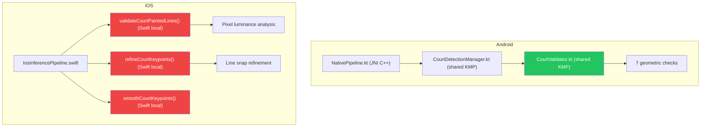

# So sánh Court Detection Logic: Android vs iOS

## 🚨 Kết luận: iOS KHÔNG sử dụng shared logic

> [!CAUTION]
> **iOS có hệ thống court detection hoàn toàn riêng biệt**, được viết 100% bằng Swift trong `IosInferencePipeline.swift`.  
> Nó **KHÔNG dùng** `CourtDetectionManager` hoặc `CourtValidator` từ shared module.

---

## Kiến trúc hiện tại



---

## So sánh chi tiết từng khía cạnh

### 1. Validation Strategy

| Feature | Android (Shared KMP) | iOS (Swift) |
|---------|---------------------|-------------|
| **Validation Type** | Geometric (shape-based) | Pixel-based (painted line detection) |
| **Bounds check** | ✅ Corners trong frame | ❌ Không có |
| **Area check** | ✅ 5%–80% frame | ❌ Không có (chỉ check bbox span > 0.18, 0.25) |
| **Corner distance** | ✅ Min 50px | ❌ Không có |
| **Convexity check** | ✅ Convex quad | ❌ Không có |
| **Aspect ratio** | ✅ 1.2–4.0 | ❌ Không có |
| **Perspective sanity** | ✅ Max 5:1 edge ratio | ❌ Không có |
| **Inner point containment** | ✅ ≥70% in quad | ❌ Không có |
| **Painted line verification** | ❌ Không có | ✅ Luminance gradient analysis |
| **Line support scoring** | ❌ | ✅ ≥5 lines, ≥2 outer, ≥3 inner, avg ≥0.18 |
| **Keypoint refinement** | ❌ | ✅ Line snap with luminance peaks |
| **Temporal smoothing** | ❌ | ✅ EMA α=0.35, max step=0.055 |
| **Tracking fallback** | ❌ (reject = reject) | ✅ Accept with relaxed thresholds if motion small |

### 2. Scheduling (5-second interval)

| Feature | Android | iOS |
|---------|---------|-----|
| **Timer mechanism** | `System.currentTimeMillis()` | `Date().timeIntervalSince(lastTime)` |
| **Interval** | 5000ms (constant) | 5.0s (constant) |
| **First frame** | Always runs | Always runs |
| **Shared logic** | ✅ `CourtDetectionManager.shouldRunCourtDetection()` | ❌ Local Swift code |

### 3. Model & Preprocessing

| Feature | Android | iOS |
|---------|---------|-----|
| **Model format** | TFLite (NNAPI/GPU/CPU) | CoreML (.mlmodel/.mlpackage) |
| **Input size** | 480×480 (C++ preprocess) | 480×480 (CIImage resize) |
| **Keypoint format** | Float pixel coords (x,y in frame pixels) | Normalized [0,1] CGPoint |
| **Keypoint count** | 14 points × 2 = 28 floats | 14 points × 2 = 28 floats |

### 4. Post-detection Processing

| Feature | Android | iOS |
|---------|---------|-----|
| **Keypoint refinement** | ❌ Raw model output | ✅ Line snap refinement (+luminance search) |
| **Smoothing** | ❌ Instant update | ✅ Exponential moving average |
| **Court invalidation** | Immediate on reject | Gradual: 5 consecutive rejects before clearing |
| **Homography computation** | ✅ `CourtHomography.computeCourtToMiniMap()` | ❌ Không có |
| **MiniMap support** | ✅ Full mini-map pipeline | ❌ Không có |

---

## Đánh giá: Cái nào tốt hơn?

### Android Strengths ✅
1. **Geometric validation mạnh**: 7 checks chặn false positive hiệu quả (đã chứng minh qua log — intro video bị reject đúng)
2. **Shared code**: Logic nằm trong KMP, dễ bảo trì
3. **MiniMap**: Có pipeline homography → minimap hoàn chỉnh
4. **Debug logging**: Keypoint dump chi tiết cho từng accept/reject

### iOS Strengths ✅
1. **Painted line verification**: Check thực tế pixel luminance — xác nhận đường kẻ sân thật sự có trong hình (chống hallucination tốt hơn)
2. **Keypoint refinement**: Snap keypoints vào đường kẻ thật → vị trí chính xác hơn
3. **Temporal smoothing**: Keypoints không nhảy lung tung giữa các frame
4. **Graceful degradation**: 5 reject liên tiếp mới clear → tránh flicker

### iOS Weaknesses ❌
1. **Không có geometric validation cơ bản**: Không check area, aspect ratio, convexity → vẫn có thể accept hình dạng vô lý nếu có đường kẻ sáng
2. **Không dùng shared code**: Duplicate logic, bảo trì khó
3. **Không có mini-map**: Thiếu feature
4. **Chạy hoàn toàn native Swift**: Không thể test cross-platform

### Android Weaknesses ❌
1. **Không verify painted lines**: Chỉ check hình dạng → model hallucination với hình dạng "hợp lệ" vẫn pass
2. **Không smooth**: Court nhảy mỗi 5s nếu model output thay đổi nhỏ
3. **Không refinement**: Keypoints là raw model output, có thể không trùng đúng đường kẻ

---

## Đề xuất: Hợp nhất logic tốt nhất từ cả 2

> [!IMPORTANT]
> **Chiến lược đề xuất**: Giữ Android (shared KMP) làm nền, bổ sung painted-line check + smoothing từ iOS.

### Pipeline thống nhất:

```
Model Output (14 keypoints)
    │
    ▼
[1] CourtValidator.validate()          ← Android shared (7 geometric checks)
    │
    ▼ (pass geometric)
[2] CourtPaintedLineVerifier (NEW)     ← Port iOS luminance logic sang KMP
    │
    ▼ (pass line verification)
[3] CourtSmoother (NEW)                ← Port iOS EMA smoothing sang KMP
    │
    ▼
[4] CourtDetectionManager              ← Accept, update homography, mini-map
```

### Ưu tiên implementation:

| Priority | Task | Impact |
|----------|------|--------|
| 🔴 P0 | iOS gọi `CourtDetectionManager` + `CourtValidator` từ shared | Thống nhất logic, eliminate false positives trên iOS |
| 🟡 P1 | Port smoothing từ iOS sang shared `CourtSmoother` | Tránh court overlay nhảy |
| 🟢 P2 | Port painted-line verification sang shared (cần pixel access API) | Chống hallucination, khó port vì cần pixel buffer access |

> [!WARNING]
> **P2 (painted-line) khó port sang KMP** vì cần truy cập pixel buffer — mỗi platform có API khác nhau (`CVPixelBuffer` vs `ByteBuffer`/JNI). Sẽ cần `expect/actual` pattern hoặc giữ native.
